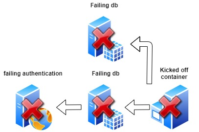
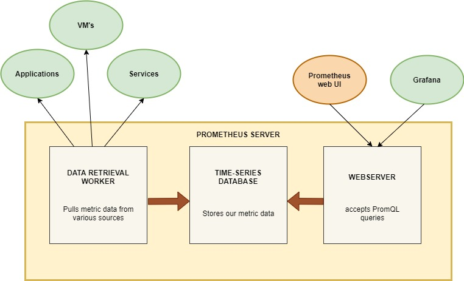
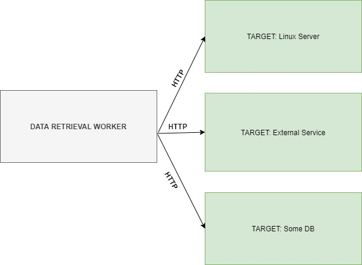

# Monitoring & Telemetry

`Learning Resources for DevOps, SRE, Cloud & Engineering Management`

[](https://www.youtube.com/channel/UCPTgt4Wo0MAnuzNEEZlk90A?sub_confirmation=1)
[](https://github.com/BINPIPE/resources/blob/master/devops-lesson-plans.md)
[](https://forms.gle/tDJxDyj2nJyfsgsk7)


**Monitoring** provides feedback from production. Monitoring delivers information about an application’s performance and usage patterns.

One goal of monitoring is to achieve high availability by minimizing time to detect and time to mitigate (TTD, TTM). In other words, as soon as performance and other issues arise, rich diagnostic data about the issues are fed back to development teams via automated monitoring. That’s TTD. DevOps teams act on the information to mitigate the issues as quickly as possible so that users are no longer affected. That’s TTM. Resolution times are measured, and teams work to improve over time. After mitigation, teams work on how to remediate problems at root cause so that they do not recur. That time is measured as TTR.

A second goal of monitoring is to enable “validated learning” by tracking usage. The core concept of validated learning is that every deployment is an opportunity to track experimental results that support or diminish the hypotheses that led to the deployment. Tracking usage and differences between versions allows teams to measure the impact of change and drive business decisions. If a hypothesis is diminished, the team can “fail fast” or “pivot”. If the hypothesis is supported, then the team can double down or “persevere”. These data-informed decisions lead to new hypotheses and prioritization of the backlog.

**Telemetry** is the mechanism for collecting data from monitoring. Telemetry can use agents that are installed in the deployment environments, an SDK that relies on markers inserted into source code, server logging, or a combination of these. Typically, telemetry will distinguish between the data pipeline optimized for real-time alerting and dashboards and higher-volume data needed for troubleshooting or usage analytics.

**Synthetic monitoring** uses a consistent set of transactions to assess performance and availability. Synthetic transactions are predictable tests that have the advantage of allowing comparison from release to release in a highly predictable manner. Real User Monitoring (RUM), on the other hand, means measurement of experience from the user’s browser, mobile device or desktop, and accounts for “last mile” conditions such as cellular networks, internet routing, and caching. Unlike synthetics, RUM typically does not provide repeatable measurement over time.

Monitoring is often used to “test in production”. A well-monitored deployment streams the data about its health and performance so that the team can spot production incidents immediately. Combined with a Continuous Deployment Release Pipeline, monitoring will detect new anomalies and allow for prompt mitigation. This allows discovery of the “unknown unknowns” in application behavior that cannot be foreseen in pre-production environments.

*Effective monitoring is essential to allow DevOps teams to deliver at speed, get feedback from production, and increase customers satisfaction, acquisition and retention.*

___

## Common Linux Monitoring Commands
Below are some common linux monitoring commands:
```
1- top  
2- htop  
3- free  
4- telnet  
5- mytop  
6- iostat  
7- sar  
8- lsof  
9- vmstat  
10- netstat
```
## Top

Top is a basic command which majority of system admins use as part of their daily job. You don’t need to install TOP as it’s already part of every Linux distribution. Following screenshot shows the result of top command. As you can see in the following screenshot running tasks , their CPU, memory and swap usage. You can do whole lot of things to get the output of your liking and need. It has a large number of options/switches which you can use to make your life easy.

`top`

## Htop

Htop is another tool just like “top” to monitor your systems processes. It comes with an interactive overview and you can kill processes by just going on them and pressing the desired button. It’s better than top because it has different mediums of showing memory and swap. You can install htop by the following command.

`yum install htop` or `apt-get install htop`

`htop`

## Free

Free also comes pre-installed with Linux distributions, to check the memory usage. It shows you buffers and cached memory as well. There are several formats like KB, MB and GB. You just have to use ‘m’ and ‘g’ parameter with the command. 

`free -m`

## Telnet

Telnet is an application protocol used on the Internet or local area network to provide a bidirectional interactive text-oriented communication facility using a virtual terminal connection. It can also be used to check open ports:

`telnet google.com 443`


## Mytop

Mytop tool allows you to monitor your systems mysql performance. It keeps refreshing itself like watch command. It opens a connection to mysql and remains in monitor state and execute the “SHOW FULL PROCESSLIST” query from time to time. Following command is used to monitor mysql database.

`mytop –u root –p XXX –d mysql`


## Iostat

Iostat command reports you the CPU and disk I/O stats. Reads and writes are shown as block read and block writes. You can get the idle percentage of your CPU to check how much time it has not done any heavy task. Following is the output of iostat command. As you can see in the following screenshot that system is 96 percent idle while sda represents you hard disk.

`iostat`


## Sar

Sar command is somehow similar to the “Iostat” command but one thing that’s different is that it tells you I/O writes for the last half hour with other parameters like system usage, i/o wait and idle time percentage. You will need to run following command to install sar command on RHEL and its derivatives.

`yum -y install sysstat` or `apt-get install sysstat`

`sysstat`

## Lsof

As you know that in Linux every process opens a file on the backend so if you want to check that a process is spawned or not, you have to check the file opened for that process in the respective partition/directory. LSOF command lets you know the files opened. For exmaple, which files are currently opened from /var partition, you will use it as:

lsof /var

## Vmstat

As the name suggests, this command is used to monitor virtual memory statistics. The best thing about this command is that it can enter monitor state on the basis of interval you have specified in the command. It lets you know the load, paging and interrupts a server is handling in that time. Following is command to monitor virtual memory after every 5 seconds.

`vmstat 5`

## Netstat

Netstat is a command-line network utility that displays network connections for Transmission Control Protocol, listening ports, routing tables, and a number of network interface and network protocol statistics. 

`netstat -tulpn`

In case this command does not work install it with:
`yum install nettools`
___

### System Monitoring with Netdata

[Netdata](https://www.netdata.cloud/)  is a system monitoring system, designed to be distributed, lightweight, flexible and open source. The source code is available for download from  [GitHub](https://github.com/netdata/netdata).

The application is able to detect hundreds of metrics automatically, simplyfing their configuration and integration. The applications core is written in C and hundreds of collectors are available to collect thousands of different metrics while being very lightweight and not requiring additional computing power. Netdata can either run autonomously, without any third-party components, or it can be integrated to existing monitoring toolchains like  [Prometheus](https://www.scaleway.com/en/docs/configure-prometheus-monitoring-with-grafana/), Graphite, OpenTSDB,  [Kafka](https://www.scaleway.com/en/docs/configure-apache-kafka/),  [Grafana](https://www.scaleway.com/en/docs/monitor-kubernetes-cluster-with-grafana/), and more.

Installing Netdata:
```
bash <(curl -Ss https://my-netdata.io/kickstart.sh)
```
Accessing Netdata:

1 . Open a web browser on your local computer, for example Chrome or Firefox.

2 . Point it to  `http://<netdata_instance_ip>:19999/`  (replace  `<netdata_instance_ip>`  with the public IP address of your instance.)

___


### Basic Docker Monitoring

Monitoring Docker, no matter if used purely or integrated into one of the systems mentioned above, should include aspects of health, performance, and resource usage of the containers. Failures in the daemon directly influence the health of the system as a whole. There are many ways to monitor basic Docker indicators.  

**Docker Stats:** The easiest tool to use and monitor Docker containers is Docker Stats, which is built into the actual Docker CLI (command line interface). Replicating much of the style known from famous Linux tools like top or iotop, it provides information about container names, CPU, memory and io (block device and network) usage.  

`docker stats`

**cAdvisor**  Runtime information together with other important metrics can be picked up with  [cAdvisor](https://github.com/google/cadvisor). cAdvisor can be launched as a docker container to monitor other docker containers. It can be launched via the following command:

```
VERSION=v0.36.0 # use the latest release version from https://github.com/google/cadvisor/releases
sudo docker run \
  --volume=/:/rootfs:ro \
  --volume=/var/run:/var/run:ro \
  --volume=/sys:/sys:ro \
  --volume=/var/lib/docker/:/var/lib/docker:ro \
  --volume=/dev/disk/:/dev/disk:ro \
  --publish=8080:8080 \
  --detach=true \
  --name=cadvisor \
  --privileged \
  --device=/dev/kmsg \
  gcr.io/cadvisor/cadvisor:$VERSION

```
cAdvisor is now running (in the background) on  `http://localhost:8080`. The setup includes directories with Docker state cAdvisor needs to observe.

___


## TELEMETRY & MONITORING FOR APPLICATIONS USING PROMETHEUS & GRAFANA

In a distributed landscape where we are working with microservices, serverless applications, or just event-driven architecture as a whole, observability, which comprises monitoring, logging, tracing, and alerting, is an important architectural concern.

There are a few reasons why we want visibility in our highly distributed systems:

-   Issues will occur, even when our best employees have built it.
-   Distributed systems generate distributed failures, which can be devastating when we are not prepared in advance.
-   Reveal mistakes early, which is great for improvement and learning.
-   It keeps us accountable.
-   Reduce the mean time to resolution (MTTR).

**PROMETHEUS**

**WHAT IS PROMETHEUS?**

Prometheus, originally developed by SoundCloud is an open source and community-driven project that graduated from the Cloud Native Computing Foundation. It can aggregate data from almost everything:

-   Microservices
-   Multiple languages
-   Linux servers
-   Windows servers

**WHY DO WE NEED PROMETHEUS?**

In our modern times of microservices, DevOps is becoming more and more complex and therefore needs automation.  
We have hundreds of processes running over multiple servers, and they are all interconnected.

If we would not monitor these services then we have no clue about what is happening on hardware level or application level.  
There are many things which we want to be notified about, like:

-   Errors
-   Response latency
-   System overload
-   Resources

When we are working with so many moving pieces, we want to be able to quickly identify a problem when something goes wrong inside one of our services.  
If we wouldn’t monitor, it could be very time-consuming, since we have no idea where to look.

**AN EXAMPLE OF A FAILING SERVICE**

Imagine that one server ran out of memory and therefore knocked off a running service container, which syncs two databases.  
One of those databases gets used by the authentication service, which now also stops working, because the database is unavailable.



How do you know what went wrong, when your application that depends on the authentication service, now can’t authenticate users anymore?  
The only thing we would see is an error message:  `ERROR: Authentication failed`.  
We would need to work backwards over every service, all the way back to the stopped container, to find out what is causing the problem.

A better way would be to have a tool which:

-   Constantly monitors all services
-   Alerts system admins when something crashes
-   Identifies problems before they occur

Prometheus is exactly that tool, it can identify memory usage, CPU usage, available disk space, etc.  
We can predefine certain thresholds about which we want to get notified.

In our example it could have been that the memory of our failing server would have reached 70% memory usage for more than one hour, and could’ve sent an alert to our admins before the crash happened.

** HOW IT WORKS**

**PROMETHEUS SERVER**

The server does the actual monitoring work, and it consists of three main parts:

-   Storage, which is a time series database.
-   Data retrieval worker, which is pulling the data from our target services.
-   Webserver, which accepts  [PromQL](https://prometheus.io/docs/prometheus/latest/querying/basics/)  queries to get data from our DB.



Even though Prometheus has its own UI to show graphs and metrics, we will be using Grafana as an extra layer on top of this webserver, to query and visualize our database.

**PROMETHEUS TARGETS**

#### WHAT DOES IT MONITOR?

Prometheus monitors nearly anything. It could be a Linux/windows server, Apache server, single applications, services, etc.  
It monitors  **units**  on those targets like:

-   CPU usage
-   Memory/ Disk usage
-   Request count
-   Request durations
-   Exceptions count

The units that we monitor are called metrics, which get saved into the Prometheus time-series database.  
Prometheus’ metrics are formatted like a human-readable text file.


In this file we can see that there is a “HELP” comment which describes what the metric is, and we have a “TYPE” which can be one of four metric-types:

-   Counter: how many times X happened (exceptions)
-   Gauge: what is the current value of X now ? (disk usage, cpu etc)
-   Histogram: how long or how big?
-   Summary: similar to histogram it monitors request durations and response sizes

#### COLLECTING METRICS FROM TARGETS

There are basically two ways of ingesting metrics into a monitoring system.  
We can either push the data from our clients to our monitoring system, or we pull the data from the monitoring system.

Prometheus is a service which polls a set of configured targets to intermittently fetch their metric values.  
In Prometheus terminology, this polling is called scraping.

There is no clear-cut answer about which one is the best, they both have their pros and cons, but some big disadvantages for pushing data are:

-   possibility of flooding the network.
-   risk of package loss.



The data which gets exposed on the endpoint needs to be in the correct format, one which Prometheus can understand.

As stated before, Prometheus can monitor a lot of different things, servers, services, databases, etc.  
Some servers even have a metrics endpoint enabled by default, so for those we don’t have to change anything.  
For the ones who don’t have an endpoint enabled by default, we need an exporter.

#### EXPORTERS

There are a number of libraries and servers which help in exporting existing metrics from third-party systems as Prometheus metrics. You can have a look at the  [exporters and integration tools](https://prometheus.io/docs/instrumenting/exporters/)  here.

On a side note, these tools are also available as Docker images, so we can use them inside Kubernetes clusters.  
We can run an exporter docker image for a MySQL database as a side container inside the MySQL pod, connect to it and start translating data, to expose it on the metrics endpoint.

#### MONITORING OUR OWN APPLICATION

If we want to add our own instrumentation to our code, to know how many server resources our own application is using, how many requests it is handling or how many exceptions occurred, then we need to use one of the  [client libraries](https://prometheus.io/docs/instrumenting/clientlibs/). These libraries will enable us to declare all the metrics we deem important in our application, and expose them on the metrics endpoint.

### MICROMETER

To monitor our Spring Boot application we will be using an exporter named Micrometer.  
Micrometer is an open-source project and provides a metric facade that exposes metric data in a vendor-neutral format which Prometheus can ingest.

> Micrometer provides a simple facade over the instrumentation clients for the most popular monitoring systems, allowing you to instrument your JVM-based application code without vendor lock-in. Think SLF4J, but for metrics.

Micrometer is not part of the Spring ecosystem and needs to be added as a dependency. In our demo application we will add this to our  `pom.xml`  file. 

## CONFIGURING PROMETHEUS

To instruct Prometheus on what it needs to scrape, we create a  **prometheus.yml**  configuration file.


In this configuration file we declare a few things:

1.  global configs, like how often it will scrape its targets.
2.  we can declare  [rule files](https://prometheus.io/docs/prometheus/latest/configuration/alerting_rules/), so when we meet a certain condition, we get an alert.
3.  which services it needs to monitor.

In this example you can see that Prometheus will monitor two things:

-   Our Spring Boot application
-   Its own health

Prometheus expects the data of our targets to be exposed on the  `/metrics`  endpoint, unless otherwise declared in the  `metrics_path`  field.

### ALERTS

With Prometheus, we have the possibility to get notified when metrics have reached a certain point, which we can declare in the  `.rules`  files. Prometheus has a component which is called the “Alertmanager”, and it can send notifications over various channels like emails, Slack, PagerDuty, etc.

### QUERYING OUR DATA

Since Prometheus saves all our data in a time series database, which is located on disk in a custom timeseries format, we need to use PromQL query language, if we want to query this database.

We can do this via the Prometheus WebUI, or we can use some more powerful visualization tools like Grafana.

## GRAFANA

### WHAT IS GRAFANA

Grafana is an open-source metric analytics & visualization application.

-   It is used for visualizing time series data for infrastructure and application analytics.
-   It is also a web application which can be deployed anywhere users want.
-   It can target a data source from Prometheus and use its customizable panels to give users powerful visualization of the data from any infrastructure under management.

### WHY GRAFANA

One of the significant advantages of Grafana are its customization possibilities.  
It’s effortless to customize the visualization for vast amounts of data.  
We can choose a linear graph, a single number panel, a gauge, a table, or a heatmap to display our data.  
We can also sort all our data with various labels so data with different labels will go to different panels.

Last but not least, there are a ton of  [premade dashboard-templates](https://grafana.com/grafana/dashboards)  ready to be imported, so we don’t have to create everything manually.


Follow this link for a DEMONSTRATION for SPRINGBOOT MONITORING USING PROMETHEUS TELEMETRY & GRAFANA DASHBOARDS.


___
:ledger: Maintainer: **[Prasanjit Singh](https://www.linkedin.com/in/prasanjit-singh)** | **www.binpipe.org**
___

[](https://opensource.org/licenses/Apache-2.0)
<br><sub><sup>
[Digital Millennium Copyright Act (DMCA) Notice](https://github.com/BINPIPE/resources/blob/master/dmca.md) <br>
If you benefited from the content here consider supporting the initiative! <br>
[](https://paypal.me/Prasanjit?locale.x=en_GB)
</sup></sub>
