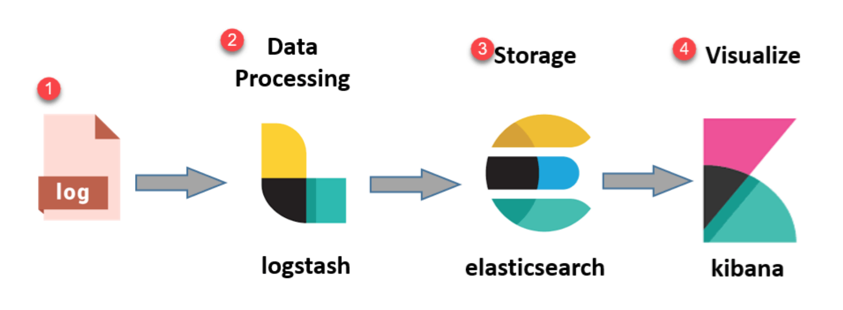

## ELK STACK

## What is the ELK Stack?

The ELK Stack is a collection of three open-source products — Elasticsearch, Logstash, and Kibana. They are all developed, managed ,and maintained by the company Elastic.

-   **E**  stands for ElasticSearch: used for storing logs
-   **L**  stands for LogStash : used for both shipping as well as processing and storing logs
-   **K**  stands for Kibana: is a visualisation tool (a web interface) which is hosted through Nginx or Apache

ELK Stack is designed to allow users to take to data from any source, in any format, and to search, analyze, and visualize that data in real time.

ELK provides centralized logging that be useful when attempting to identify problems with servers or applications. It allows you to search all your logs in a single place. It also helps to find issues that occur in multiple servers by connecting their logs during a specific time frame.

1. **Logs:** Server logs that need to be analyzed are identified
2. **Logstash:**  Collect logs and events data. It even parses and transforms data
3. **ElasticSearch:** The transformed data from Logstash is  Store, Search, and indexed.
4.  **Kibana:** Kibana uses Elasticsearch DB to Explore, Visualize, and Share

**[FOLLOW THIS REPO QUICK INSTALL ELK STACK USING DOCKER](https://github.com/deviantony/docker-elk)**
