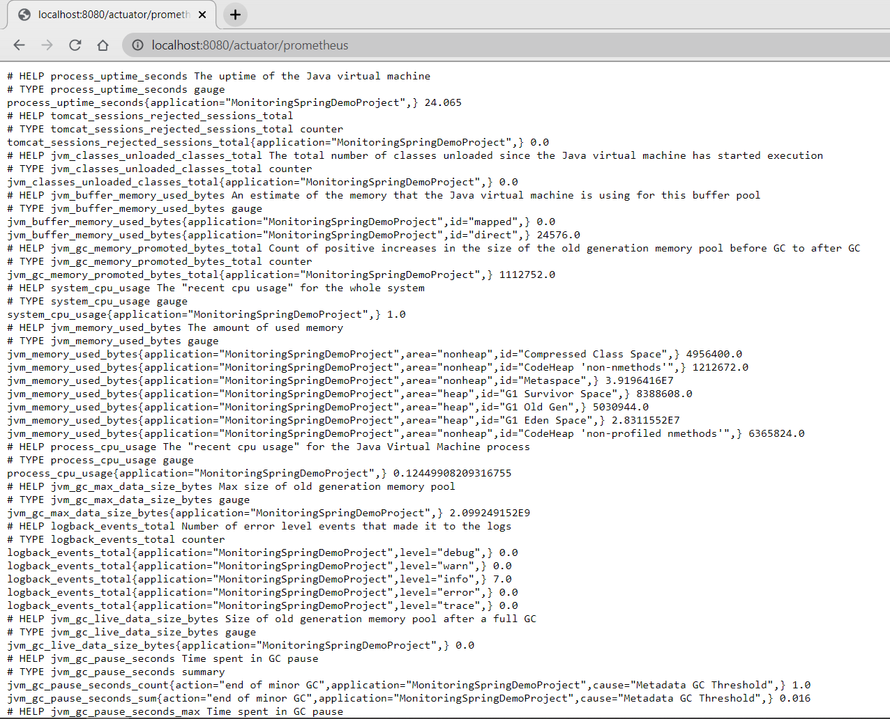
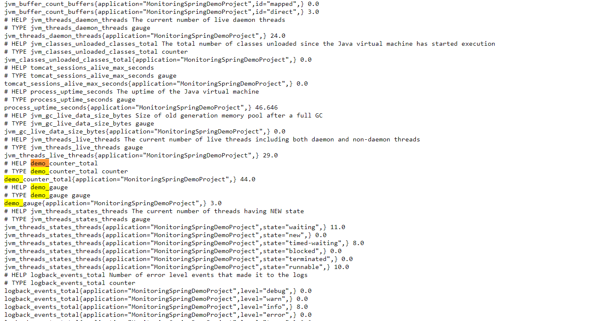
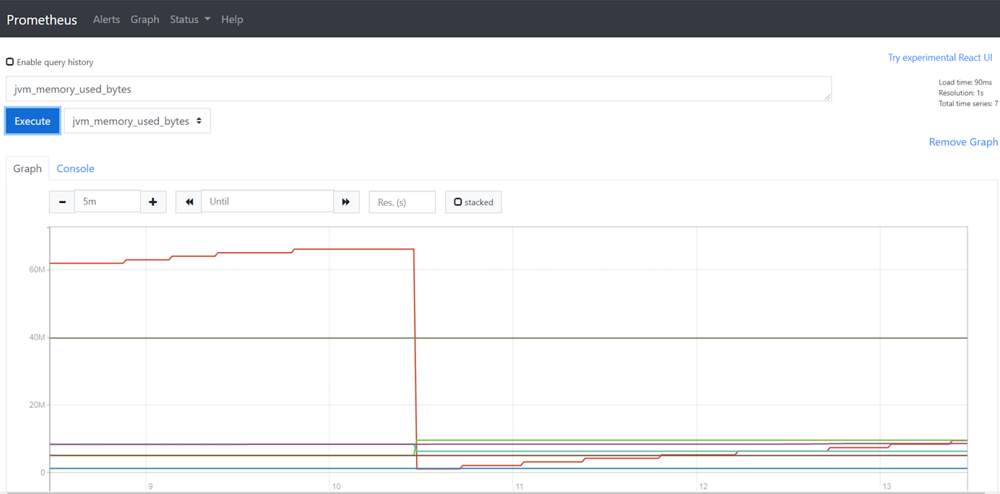
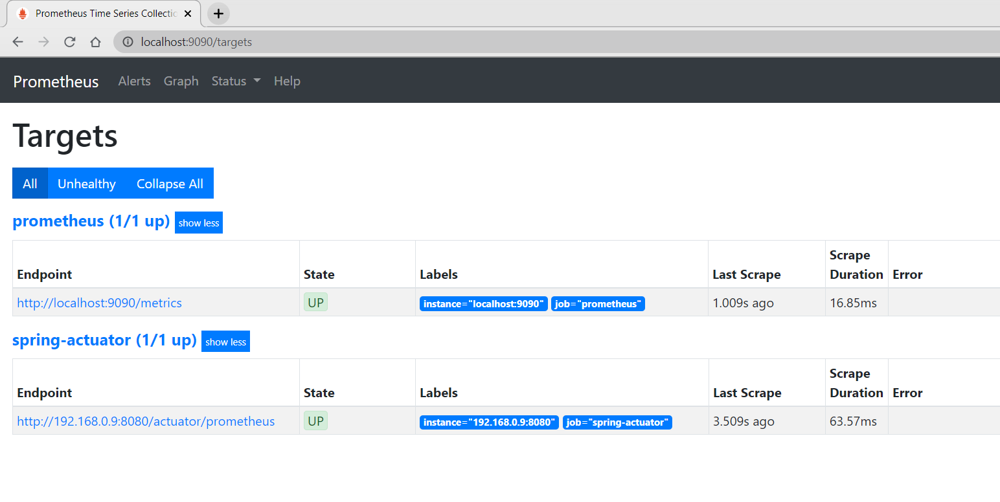
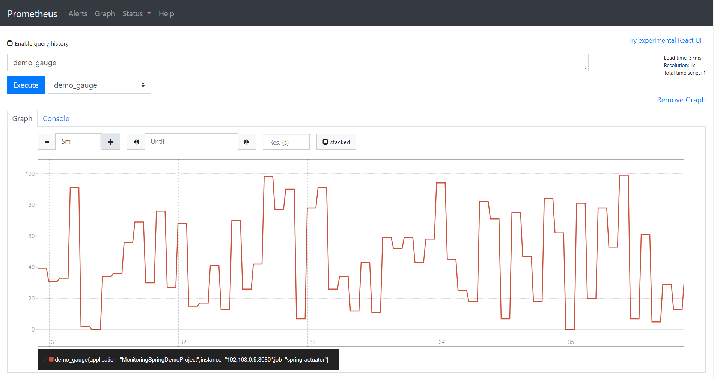
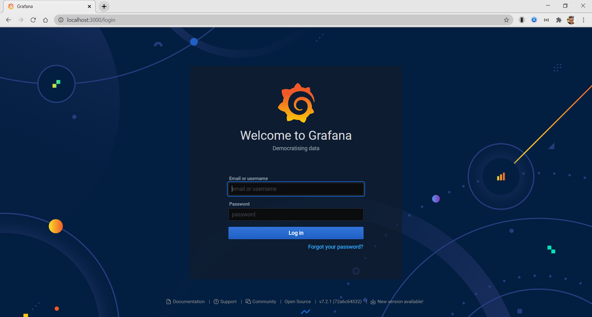
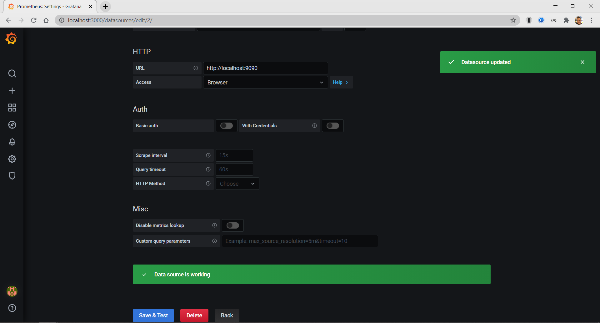
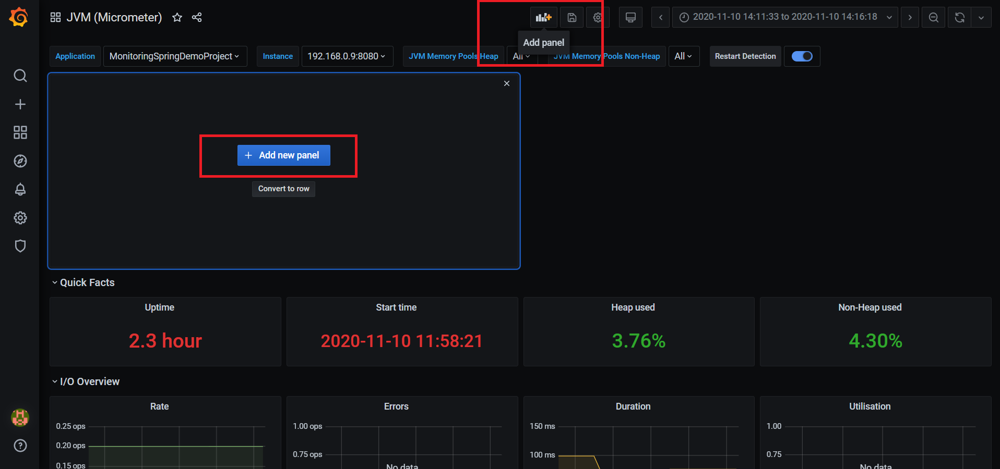
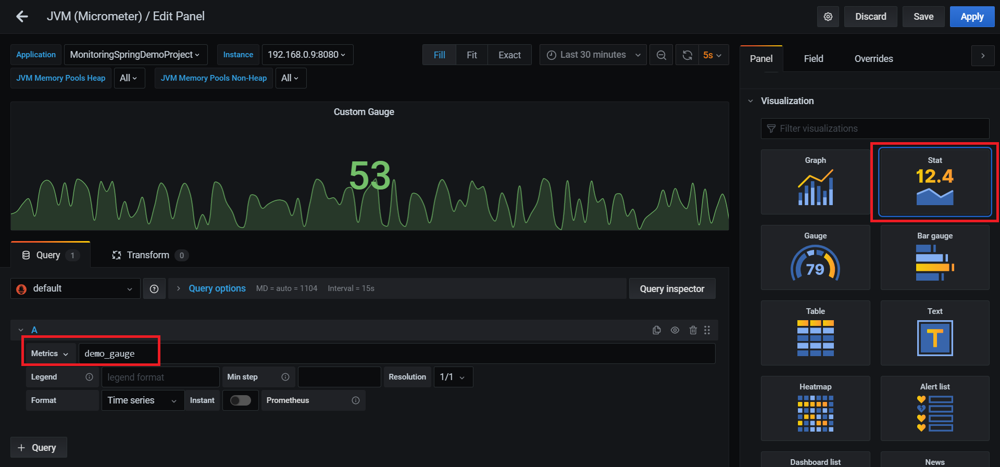
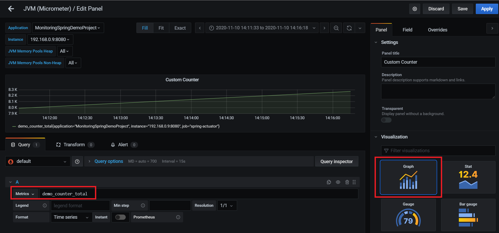

## DEMONSTRATION FOR SPRINGBOOT APP MONITORING WITH PROMETHEUS & GRAFANA

### SETUP SPRING BOOT

To demonstrate how to implement Prometheus and Grafana in your own projects, I will go through the steps to set up a basic Spring Boot application which we monitor by using Docker images of Prometheus and Grafana.

1.  Set up a regular Spring Boot application by using  [Spring Initializr](https://start.spring.io/).
    
2.  Add dependency for Actuator
    
    ```
         <dependency>
             <groupId>org.springframework.boot</groupId>
             <artifactId>spring-boot-starter-actuator</artifactId>
         </dependency>
    
    ```
    
3.  Add dependency for Micrometer
    
    ```
         <dependency>
             <groupId>io.micrometer</groupId>
             <artifactId>micrometer-registry-prometheus</artifactId>
             <version>1.5.5</version>
         </dependency>
    
    ```
    
4.  Expose our needed Prometheus endpoint in the application.properties file
    
    ```
    management.endpoints.web.exposure.include=prometheus
    management.endpoint.health.show-details=always
    management.metrics.tags.application= MonitoringSpringDemoProject
    
    ```
    
5.  After this we can run the application and browse to  `localhost:8080/actuator`, where we can see all the available endpoints. The one we need and will use to monitor this application, is  `localhost:8080/actuator/prometheus`.



### ADDING OUR OWN CUSTOM METRICS

We can also define some custom metrics, which I will briefly demonstrate in this section.

To be able to monitor custom metrics we need to import  `MeterRegistry`  from the Micrometer library and inject it into our class. This gives us the possibility to use  [counters](https://github.com/micrometer-metrics/micrometer/blob/master/micrometer-core/src/main/java/io/micrometer/core/instrument/Counter.java#L25),  [gauges](https://github.com/micrometer-metrics/micrometer/blob/master/micrometer-core/src/main/java/io/micrometer/core/instrument/Gauge.java#L23),  [timers](https://github.com/micrometer-metrics/micrometer/blob/master/micrometer-core/src/main/java/io/micrometer/core/instrument/Timer.java#L34)  and more.

To demonstrate how we can use this, I added two classes in our basic Spring application.  
DemoMetrics has a custom Counter and Gauge, which will get updated every second through our DemoMetricsScheduler class.  
The counter gets incremented by one, and the gauge will get a random number between 1 and 100.

##### DEMOMETRICS CLASS

```
@Component
public class DemoMetrics {
    private final Counter demoCounter;
    private final AtomicInteger demoGauge;

    public DemoMetrics(MeterRegistry meterRegistry) {
        this.demoCounter = meterRegistry.counter("demo_counter");
        this.demoGauge = meterRegistry.gauge("demo_gauge", new AtomicInteger(0));
    }

    public void getRandomMetricsData() {
        demoGauge.set(getRandomNumberInRange(0, 100));
        demoCounter.increment();
    }

    private static int getRandomNumberInRange(int min, int max) {
        if (min >= max) {
            throw new IllegalArgumentException("max must be greater than min");
        }

        Random r = new Random();
        return r.nextInt((max - min) + 1) + min;
    }
}

```

##### DEMOMETRICSSCHEDULER CLASS

```
@Component
public class DemoMetricsScheduler {

    private final DemoMetrics demoMetrics;

    public DemoMetricsScheduler(DemoMetrics demoMetrics) {
        this.demoMetrics = demoMetrics;
    }

    @Scheduled(fixedRate = 1000)
    public void triggerCustomMetrics() {
        demoMetrics.getRandomMetricsData();
    }
}

```

Now we are able to see our custom metrics on the  `/actuator/prometheus`  endpoint, as you can see below.



### SETUP PROMETHEUS

The easiest way to run Prometheus is via a Docker image which we can get by running:

```
docker pull prom/prometheus

```

After we download the image, we need to configure our  `prometheus.yml`  file. Since I want to demonstrate how to monitor a Spring Boot application, as well as Prometheus itself, it should look like this:

```
global:
    scrape_interval:     15s

scrape_configs:
- job_name: 'prometheus'
  scrape_interval: 5s

  static_configs:
    - targets: ['localhost:9090']

- job_name: 'spring-actuator'
  metrics_path: '/actuator/prometheus'
  scrape_interval: 5s
  static_configs:
    - targets: ['192.168.0.9:8080']

```

We define two targets which it needs to monitor, our Spring application and Prometheus.  
Since we run Prometheus from inside Docker we need to enter the host-ip which is in my case  `192.168.0.9`.

Afterwards we can run the Prometheus image by running the following command:

```
docker run -d -p 9090:9090 -v <PATH_TO_prometheus.yml_FILE>:/etc/prometheus/prometheus.yml prom/prometheus 

```

We mount the  `prometheus.yml`  config file into the Prometheus image and expose port 9090, to the outside of Docker.

When this is up and running we can access the Prometheus webUI on  `localhost:9090`.



When we navigate to Status > Targets, we can check if our connections are up and are correctly configured.



Yet again, we can check our custom metrics in the Prometheus UI, by selecting the  `demo_gauge`  and inspecting our graph.



### SETUP GRAFANA

To run Grafana we will use the same approach as with Prometheus.

We download and run the image from Docker Hub.

```
docker run -d -p 3000:3000 grafana/grafana

```

Now we can access the Grafana UI from  `localhost:3000`, where you can enter “admin” as login and password.



After we arrive at the landing page, we need to set up a data source for Grafana.  
Navigate to Configuration > Data Sources, add a Prometheus data source and configure it like the example below.



For this example I used one of the premade dashboards which you can find on the  [Grafana Dashboards](https://grafana.com/grafana/dashboards)  page.  
The dashboard I used to monitor our application is the JVM Micrometer dashboard with import id: 4701.


Give your dashboard a custom name and select the prometheus data source we configured in step 3.  
Now we have a fully pre-configured dashboard, with some important metrics showcased, out of the box.


### ADDING A CUSTOM METRIC PANEL

To demonstrate how we can create a panel for one of our own custom metrics, I will list the required steps below.

First we need to add a panel by clicking on “add panel” on the top of the page, and yet again on “add new panel” in the center.



Then we need to configure our panel, which we do by selecting  `demo_gauge`  in the metrics field.  
To display our graph in a prettier way, we can choose the “stat” type under the visualization tab.



When we click on  `Apply`  in the top right corner, our new panel gets added to the dashboard.

Afterwards, we can do the same thing for our  `demo_counter`  metric.



After going through all of these steps, we now have an operational dashboard which monitors our Spring Boot application, with our own custom metrics.


